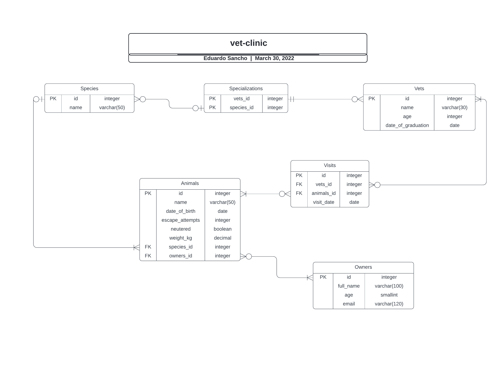

# Vet Clinic

This project contains the SQL commands to create a table called *animals*, populate it with sample items and filter depending on multiple parameters.
___Try it out___

## Requirements
PostgreSQL must be installed :(

  - [MacOS Install Guide](https://www.postgresql.org/download/macosx/)
  - [Linux Install Guide](https://www.postgresql.org/download/linux/debian/)
## Getting Started

Clone this repository by running: 
`git clone https://github.com/eduardosancho/vet-clinic.git`

This repository includes files with plain SQL that can be used to recreate a database:

1. Run this in your bash terminal to gain access to postgres command line
~~~ bash
$ psql postgres
~~~

2. Create a new database with any name ('vet-clinic' is suggested), and connect to that database.
~~~ postgres
# CREATE DATABASE <database_name>;
# \c <database_name>
~~~

3. Use [schema.sql](./schema.sql) to create all tables. Copy and paste the content of this file into the postgres command line. That should create the tables in your database.
Now verify it. The following command displays all tables in your database:
~~~ postgres
# \d
~~~

4.  Use [data.sql](./data.sql) to populate tables with sample data. Copy and paste the content of this file into the postgres command line. That should create the tables in your database.
Now verify it. The following command displays all content in your selected table:
~~~ postgres
# SELECT * FROM <table_name>;
~~~

5. Check [queries.sql](./queries.sql) for examples of queries that can be run on a newly created database. Copy and paste the content of this file into the postgres command line. That should create the display an enormous list of queries that I prepared. It's recommended to run them individually for better understanding.
**Important note: this file might include queries that make changes in the database (e.g., remove records). Use them responsibly!**

### And that's pretty much all. Feel free to experiment!

## 👤 Author

| Social       | Username                                               |
| ------------ | ---------------------------------------------------- |
 **GitHub**  | [@eduardosancho](https://github.com/eduardosancho)
 **Twitter** | [@sanchitoblog](https://twitter.com/sanchitoblog)
 **LinkedIn** | [Eduardo Sancho Solano](https://www.linkedin.com/in/eduardo-sancho-solano/)

## 🤝 Contributing

Contributions, issues, and feature requests are welcome!

Feel free to check the [issues page](../../issues/).

## Show your support

Give a ⭐️ if you like this project!

## Acknowledgments

- [Tutorials Point](https://www.tutorialspoint.com/postgresql/postgresql_create_table.htm)

## 📝 License

This project is [MIT](./MIT.md) licensed.
